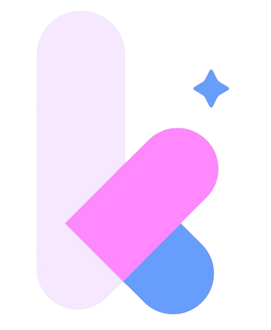

<p align="center">
  
</p>

<h1 align="center">PacarKu</h1>

<p align="center">
  <strong>Pacar AI paling ngerti kamu.</strong><br/>
  Chat natural lewat WhatsApp — available 24/7, privasi terjamin.
</p>

<p align="center">
  <a href="https://pacarku.com">Live Site</a> ·
  <a href="#fitur-utama">Fitur</a> ·
  <a href="#tech-stack">Tech Stack</a> ·
  <a href="#getting-started">Getting Started</a>
</p>

---

## Tentang

PacarKu adalah AI companion yang hidup di dunia nyata — bukan chatbot biasa. Dia punya wajah, kepribadian, dan ingatan sendiri. Kamu bisa chat lewat WhatsApp tanpa harus download aplikasi baru.

Landing page ini dibangun sebagai showcase utama produk PacarKu, dengan fokus pada **pengalaman visual premium** dan **interaksi yang engaging**.

## Preview

> **Note:** Screenshot belum tersedia. Clone repo ini dan jalankan `npm run dev` untuk melihat langsung.

## Fitur Utama

### 🎬 3D Scroll-Driven Hero

Hero section menggunakan 192 frame animasi karakter Ara yang di-render ke `<canvas>`, digerakkan oleh scroll position. Frame loading progressive — frame pertama tampil instan, sisanya di-load background. Smooth scrolling dihandle lewat `Lenis` + Framer Motion `useSpring` untuk menghilangkan jank di mouse Windows.

### 🃏 Interactive Companion Selector

Tiga karakter AI — **Gracia Amadea**, **Ara Kayla**, dan **Lisa Permata** — ditampilkan dalam layout collage interaktif. Klik salah satu karakter membuka fullscreen modal dengan `layoutId` animation dari Framer Motion, menampilkan profil lengkap: personality, traits, dan deskripsi.

### 📦 Bento Grid Features

Section fitur menggunakan layout bento grid (12-column CSS Grid) dengan kartu-kartu feature yang punya hover effects, top highlight gradient, dan scroll-reveal animation. Setiap kartu punya icon, tags, dan link optional.

### 🧭 Glassmorphism Navbar

Navbar muncul setelah scroll melewati hero section, dengan `backdrop-blur`, border transparan, dan opacity yang dikontrol `useTransform` dari Framer Motion.

### ✨ Detail Kecil yang Bikin Beda

- **Animated Grid Background** — pattern grid yang terus bergerak di belakang semua section
- **Scroll Reveal** — setiap elemen masuk viewport dengan fade-in + translate yang staggered
- **Custom Scrollbar** — scrollbar yang match dengan color palette
- **Reduced Motion Support** — semua animasi dihormati `prefers-reduced-motion`
- **Ethereal Blur Mask** — CSS mask pada gambar karakter biar melebur natural ke background

## Tech Stack

| Layer | Technology |
|-------|-----------|
| Framework | [React 19](https://react.dev) + TypeScript |
| Build Tool | [Vite 8](https://vite.dev) |
| Styling | [Tailwind CSS v4](https://tailwindcss.com) (CSS-first config via `@theme`) |
| Animation | [Framer Motion 12](https://motion.dev) |
| Smooth Scroll | [Lenis](https://lenis.darkroom.engineering) |
| Icons | [Lucide React](https://lucide.dev) |
| Fonts | League Spartan, Manrope (Google Fonts) |

## Struktur Proyek

```
pacarku-landing/
├── public/
│   ├── animated_ara/          # 192 frame animasi karakter (JPG sequence)
│   ├── logo_pacarku.png
│   ├── favicon.svg
│   └── icons.svg
├── src/
│   ├── assets/                # Gambar karakter (Ara, Gracia, Lisa)
│   ├── components/
│   │   ├── Hero.tsx           # 3D scroll-driven hero + canvas animation
│   │   ├── Features.tsx       # Bento grid fitur produk
│   │   ├── CallToAction.tsx   # Companion selector + character modal
│   │   ├── Navbar.tsx         # Floating glassmorphism navbar
│   │   ├── Footer.tsx         # Minimal footer
│   │   ├── AnimatedGrid.tsx   # Moving grid background
│   │   ├── ScrollReveal.tsx   # Scroll-triggered reveal wrapper
│   │   └── IntroText.tsx      # (Archived — merged into Hero timeline)
│   ├── index.css              # Design tokens & global styles
│   ├── App.tsx                # Root layout + Lenis init
│   └── main.tsx               # React entry point
├── index.html                 # HTML template + OG tags
├── vite.config.ts
├── tsconfig.json
└── package.json
```

## Getting Started

### Prerequisites

- **Node.js** ≥ 18
- **npm** ≥ 9

### Install & Run

```bash
# Clone repo
git clone https://github.com/iyantama9/pacarku-landing.git
cd pacarku-landing

# Install dependencies
npm install

# Start dev server
npm run dev
```

Dev server berjalan di `http://localhost:5173`.

### Build Production

```bash
npm run build
```

Output di folder `dist/`, siap deploy ke hosting manapun (Nginx, Vercel, Netlify, dll).

## Color Palette

| Token | Hex | Kegunaan |
|-------|-----|----------|
| `--color-bg` | `#0b0914` | Background utama |
| `--color-primary` | `#fe88fe` | Pink — accent utama, highlight text |
| `--color-secondary` | `#679dfc` | Blue — label, secondary elements |
| `--color-tertiary` | `#f5e7fe` | Light pink-white — soft text |
| `--color-accent` | `#679dfc` | Accent blue untuk glow effects |

## Performance Notes

- **Target build:** ES2015, kompatibel sampai Safari 10+
- **Frame loading:** Progressive — first frame instant, rest lazy-loaded
- **Canvas rendering:** Direct `drawImage` ke canvas, skip DOM overhead
- **Scroll optimization:** `useSpring` + `useTransform` dari Framer Motion, bukan event listener manual
- **Hardware acceleration:** `translateZ(0)` + `will-change: transform` pada elemen kritis

## Author

**Whilyan Pratama**
Informatics — Universitas Sebelas Maret

---

<p align="center">
  <sub>Made with late-night caffeine and too many scroll calculations.</sub>
</p>
